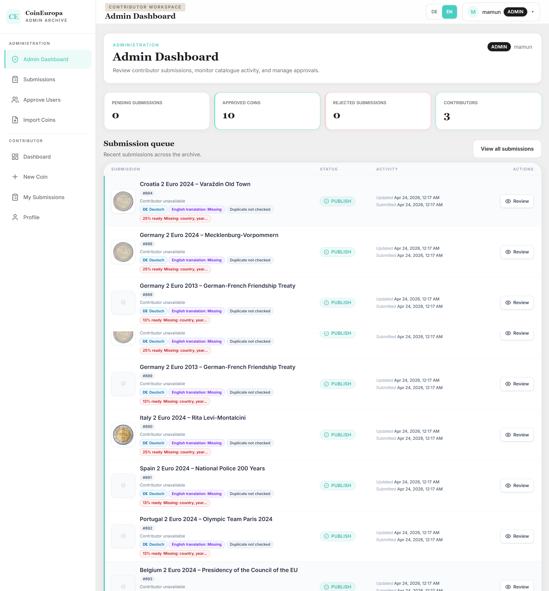
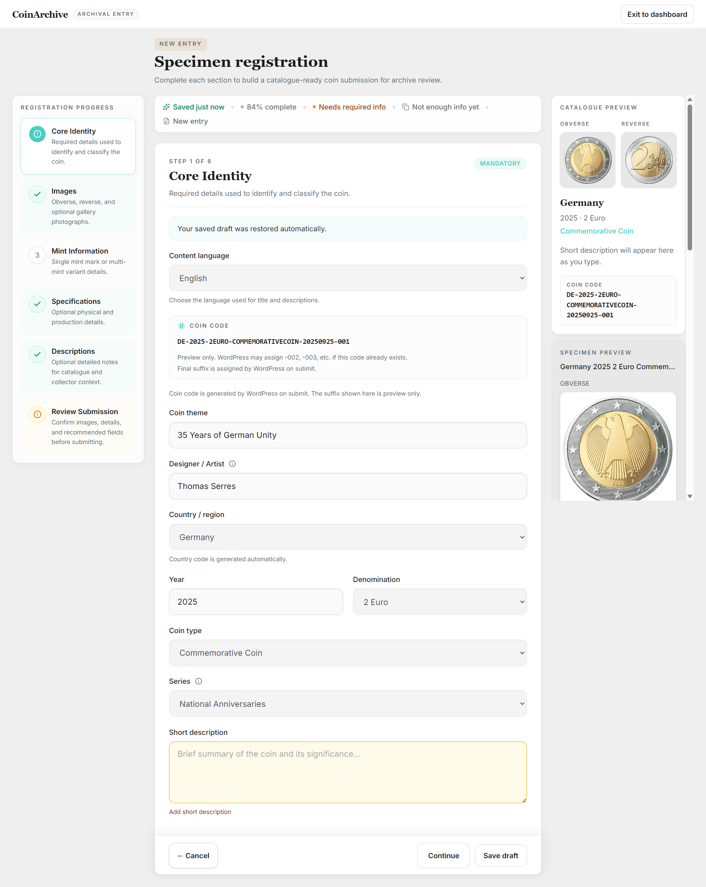
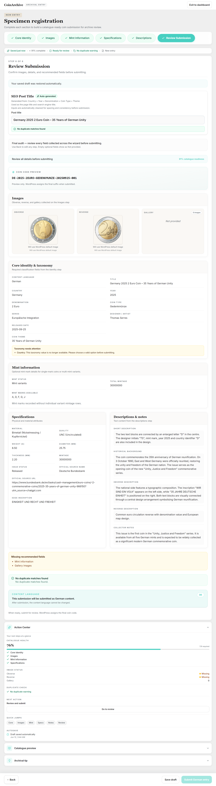
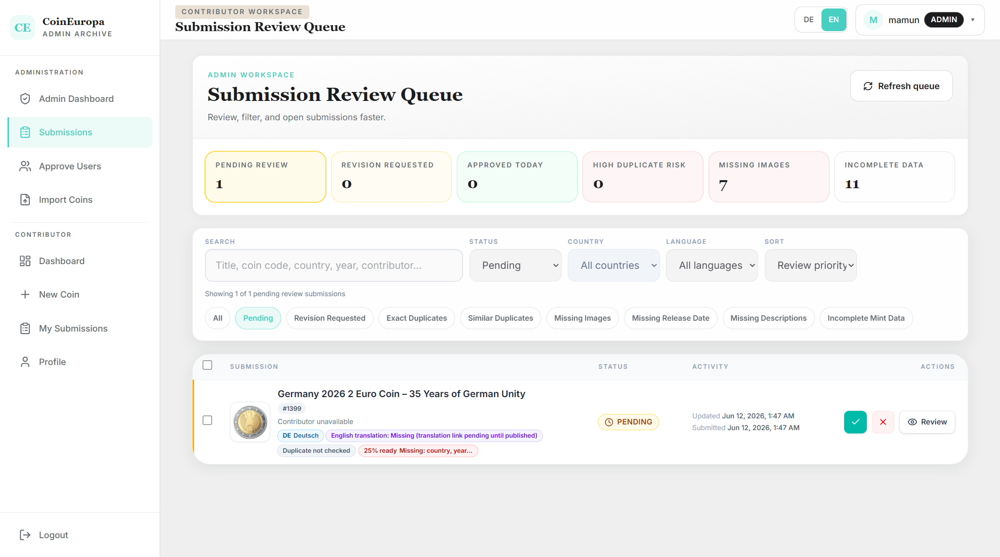
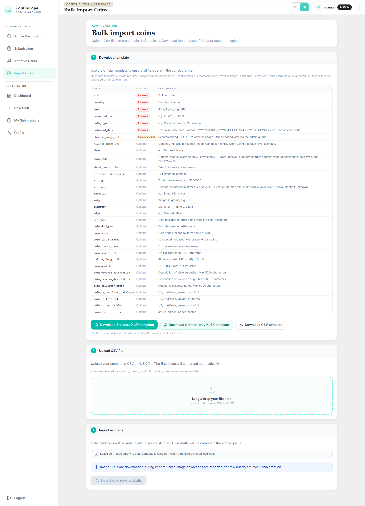

# CoinArchive

Open-source platform for collecting, cataloging, submitting, reviewing, and managing €2 commemorative coin data.

CoinArchive consists of:

* React Contributor Portal
* WordPress Backend Plugin
* ACF-based Coin Data Model
* Polylang EN/DE Multilingual Workflow

---

# Screenshots

## Dashboard



## New Coin Wizard



## Review Submission



## Admin Queue



## Import Tool



---

# Features

## Contributor Portal

* Contributor registration
* Email verification
* Password reset
* Coin submission wizard
* Draft management
* Duplicate protection
* Coin code generation
* EN / DE multilingual workflow
* Tablet and mobile optimized workflow
* XLSX import support

## WordPress Backend

* Contributor approval workflow
* Submission review queue
* Admin dashboard
* XLSX / CSV import
* Duplicate detection
* REST API
* ACF integration
* Polylang integration
* Revision tracking

---

# Requirements

## WordPress

Required:

* WordPress 6.x+
* PHP 8.1+
* ACF Pro
* Polylang

## Frontend

Required:

* Node.js 20+
* npm

---

# Installation

## 1. Install WordPress Plugin

Copy:

```text
wordpress/coinarchive-external-submissions
```

to:

```text
wp-content/plugins/
```

Activate the plugin.

---

## 2. Import ACF Fields

Install **ACF Pro**.

Navigate to:

```text
Custom Fields → Tools → Import Field Groups
```

Import:

```text
acf/acf-export-2026-06-12.json
```

---

## 3. Configure Polylang

Create languages:

* English (EN)
* German (DE)

Configure your Coin post type to support Polylang translations.

---

## 4. Configure WordPress Constants

Add to `wp-config.php`:

```php
define('COINARCHIVE_SUBMISSION_API_KEY', 'your-secret-key');
define('CAES_GEMINI_API_KEY', 'your-gemini-api-key');
```

Gemini AI descriptions are optional.

---

## 5. Configure Contributor Portal

Navigate to:

```bash
apps/contributor-portal
```

Install dependencies:

```bash
npm install
```

Create:

```text
.env.local
```

Example:

```env
VITE_API_BASE_URL=https://your-site.com/wp-json/coinarchive/v1
VITE_ADMIN_API_KEY=your-admin-api-key
```

Run development server:

```bash
npm run dev
```

Production build:

```bash
npm run build
```

---

# Repository Structure

```text
coinarchive/
├── apps/
│   └── contributor-portal/
├── wordpress/
│   └── coinarchive-external-submissions/
├── acf/
│   └── acf-export-2026-06-12.json
├── screenshots/
├── docs/
├── LICENSE
└── README.md
```

---

# Workflow

1. Contributor registers.
2. Contributor verifies email.
3. Admin approves contributor.
4. Contributor submits coin data.
5. Submission enters review queue.
6. Admin reviews submission.
7. Coin is published.

---

# License

MIT License
